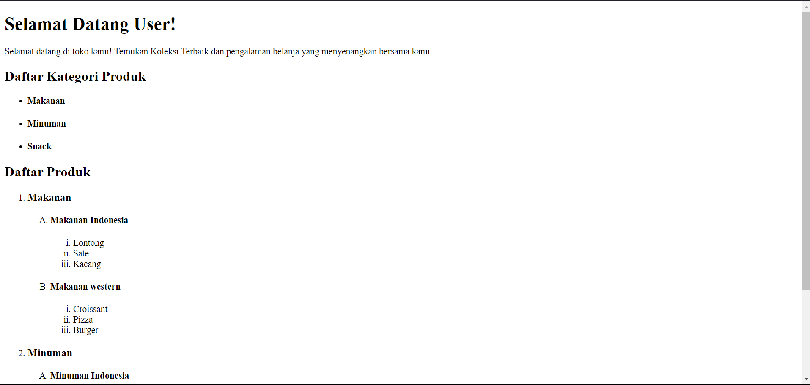

# HTML Challenge

This is a solution to the challenge i got from my university class. I was challenged to clone a simple HTML to learn about HTML Lists.

## Overview

### Screenshot



## My process

### Built with

- HTML

### What I learned

I learned how to create Nested lists, use different "ticks" for different list levels, and also use different heading levels for different list levels. This is one of the snippets of the code where i gain the most insight.

```html
<h2>Daftar Produk</h2>
        <ol>
            <li>
                <h3>Makanan</h3>
                <ol type="A">
                    <li><h4>Makanan Indonesia</h4>
                        <ol type="i">
                            <li>Lontong</li>
                            <li>Sate</li>
                            <li>Kacang</li>
                        </ol>
                    </li>
```

You can see that I use `h3` in the first level of the list and `h4` in the second level, and I use different "ticks" (`type="A"` and `type="i"`) for each level of the lists.

## Author

- LinkedIn - [Alif Rachmat Illahi](https://www.linkedin.com/in/alifrachmat/)
- GitHub - [@alifrachmat2002](https://github.com/alifrachmat2002)
- Frontend Mentor - [@alifrachmat2002](https://www.frontendmentor.io/profile/alifrachmat2002)

## Acknowledgments

- [Nadhif Lazuardi](https://github.com/nadhiflazuardi)


